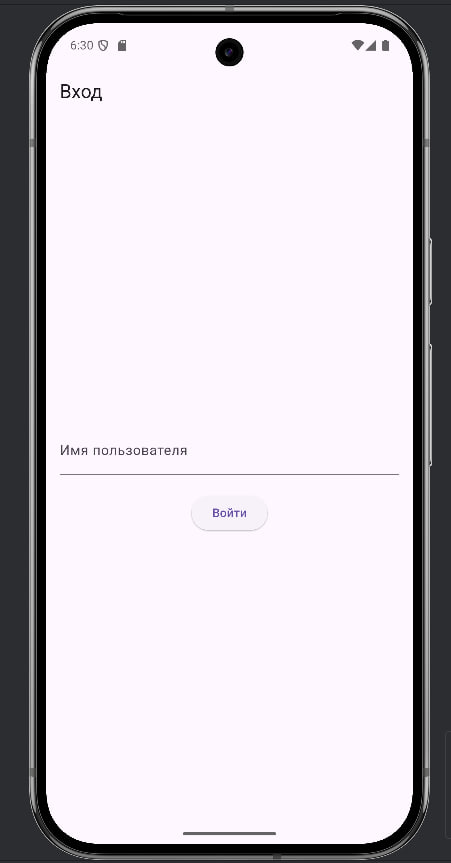
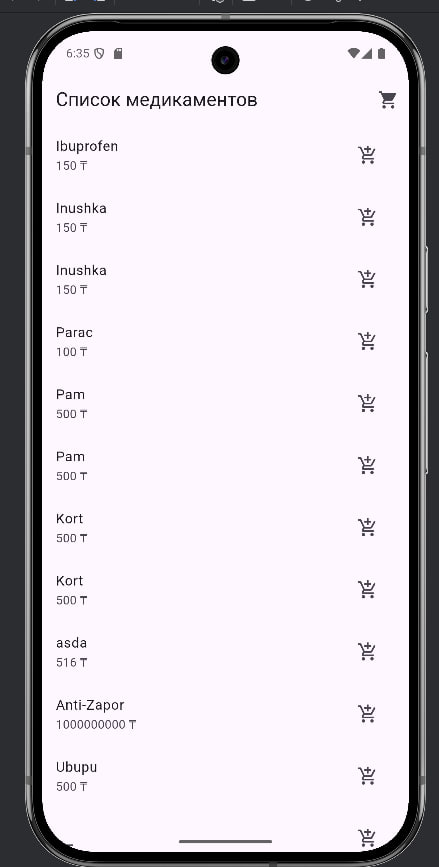
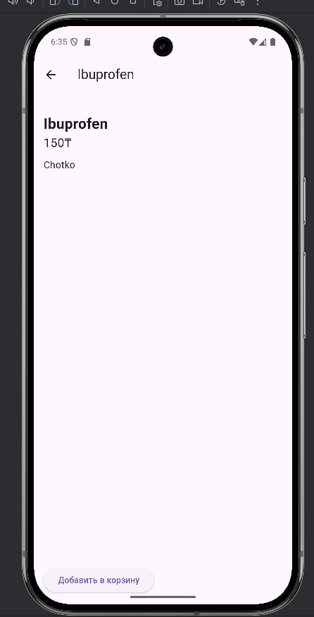
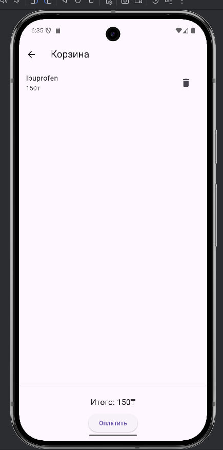

это кроссплатформенное медицинское приложение для заказа лекарств. 
Система построена на Flutter (frontend) и ASP.NET Core (backend), с поддержкой аутентификации через JWT и управлением заказами.

<h3> Стек технологий </h3>

Frontend - Flutter
Backend - ASP.NET Core Web API
Аутентификация - JWT (JSON Web Token)
База данных - PostgreSQL (через EF Core)
IDE  Rider


<h3> Основной функционал </h3>

1. Регистрация и вход с JWT-аутентификацией
2. Просмотр списка медикаментов
3. Добавление лекарств в корзину
4. Оформление и просмотр заказов
5. Поиск медикаментов

<h2> Скриншоты </h2>

<h3> Вход </h3>



<h3> список медикаментов </h3>



<h3> описание таблетки </h3>



<h3> корзина </h3>



## Структура проекта

```
Api_v2/
│
├── backend/
│   ├── Controllers/
│   ├── Models/
│   ├── Data/
│   └── Program.cs
│
├── frontend/
│   ├── lib/
│   │   ├── pages/
│   │   └── services/
│
└── README.md
```